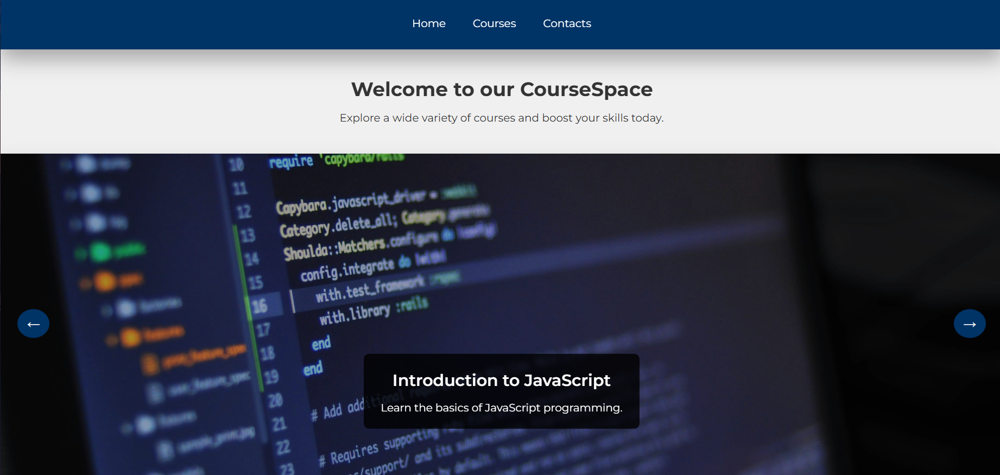
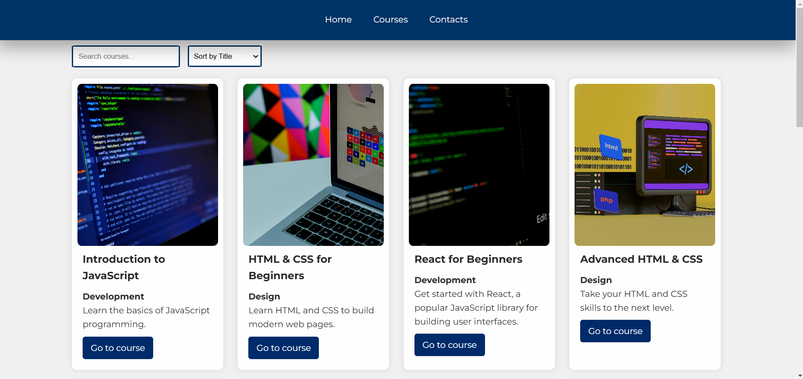
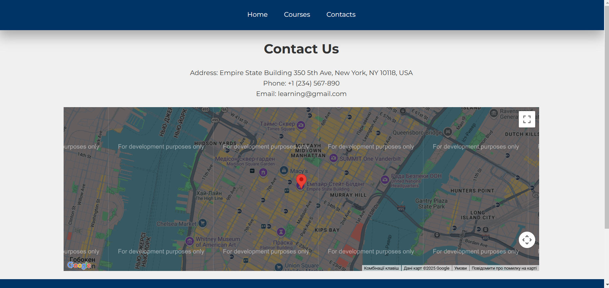

## SpaceCourse

## Description
CourseSpace is an online learning website where users can browse and enroll in courses. The platform includes the following features:
- A course list with filtering and search functionality
- Course details including titles, instructors and topics.
- A responsive design with interactive elements such as pagination and sorting

## Visuals

## Installation

1. Clone the repository:
   git clone https://github.com/username/courseSpace.git
   cd courseSpace

## Usage
Once the project is set up, you can browse courses, apply filters for various types of courses, and use the search functionality to find the most relevant courses. Detailed course information, including content, instructors, and difficulty levels, is available.

## Support
If you need help, create an issue or contact us at support@courseSpace.com.

## Roadmap
Future features for CourseSpace may include:
Integration with payment systems for course enrollment
User profiles to track course enrollments
Gamification features such as badges or certificates

## Contributing
We welcome contributions! Please fork the repository, create a new branch, and submit a pull request. Ensure that you've added proper tests and documentation for new features or bug fixes.
To set up the project locally and make contributions, follow these steps:
Fork the repository on GitHub.
Clone your forked repository:

git clone https://github.com/your-username/courseSpace.git
cd courseSpace
Create a new branch:

git checkout -b feature-name
Make changes and commit:

git add .
git commit -m "Added new feature or fixed a bug"
Push your changes:

git push origin feature-name
Open a pull request on GitLab.

## Authors and acknowledgment

Olha Shamanovska - Developer
Olha Shamanovska - UI/UX Designer

## Project status
The project is actively being developed. We are continually adding new features and improving the user experience.

